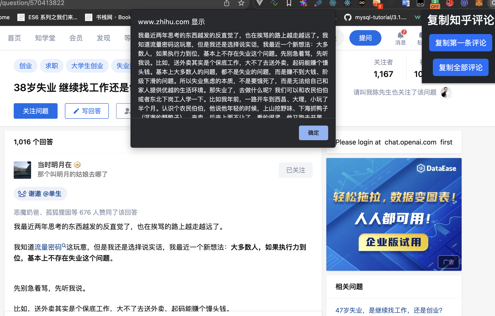
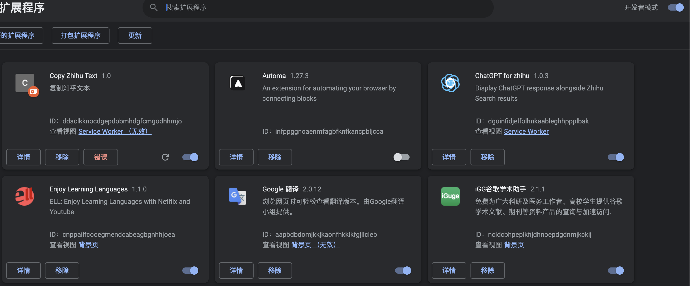
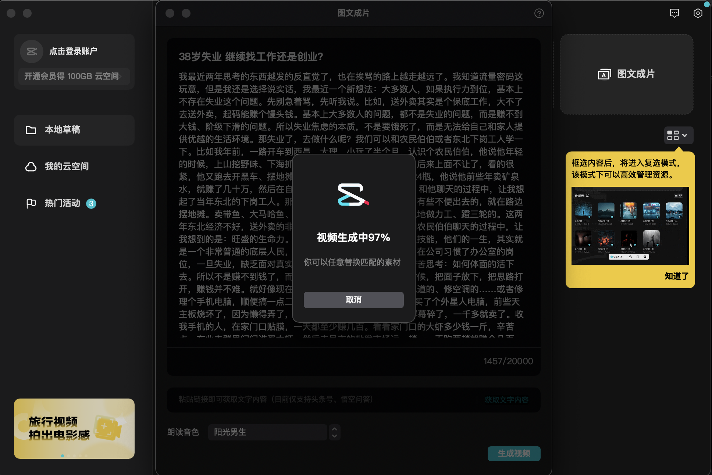
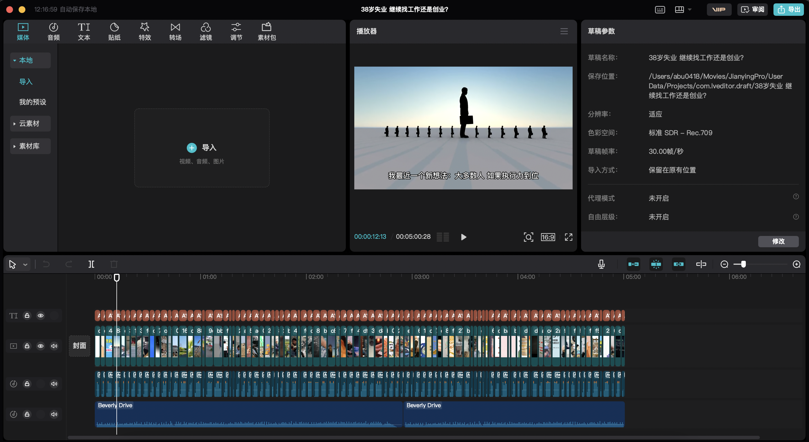
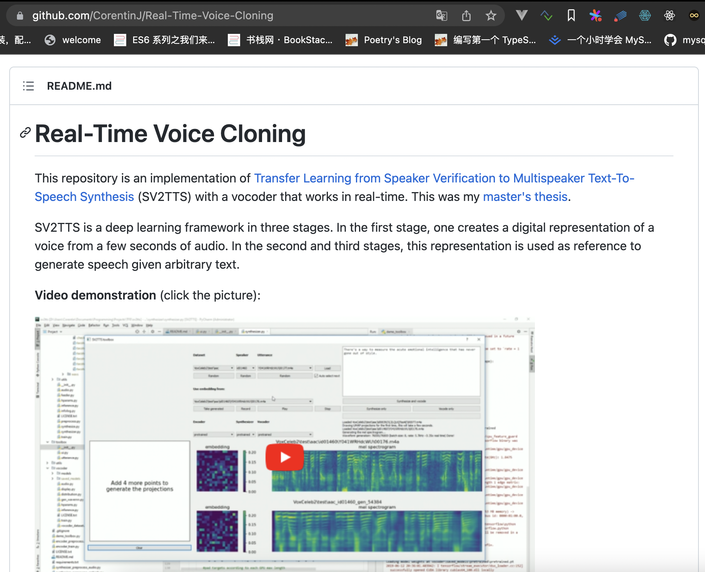

# 复制知乎文字

## 插件使用方式

1. 克隆本项目

2. chrome打开开发者模式，加载该项目文件夹

## 扩展

提取到知乎问题评论后，可以使用剪映进行文字转视频功能

## 后期

后期尝试直接调用抖音提供的文字转视频接口，实现自动化生成视频发布抖音

## 关于版权

暂时考虑不到这玩意，或者创作者可以与知乎作者协商带上署名

## 关于视频质量

视频质量我大概看过，还凑合。质不够，那么我们量来凑，搞个主机或者云服务器，把服务部署上去，基本上全是自动化的事情，人基本可以躺着

视频地址：[阿里云盘](https://www.aliyundrive.com/s/i6KysKbpiu7)

视频可以再加上对应的bgm，配音这里抖音官方的配音好像不太行，可以试试以下这个

[5秒克隆语音，实时生成任意语音](https://github.com/CorentinJ/Real-Time-Voice-Cloning)

方法已经说了，下面就是执行力了😄